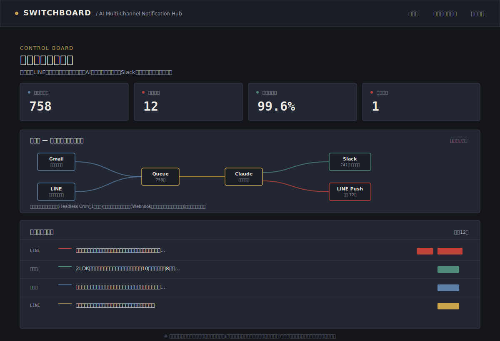
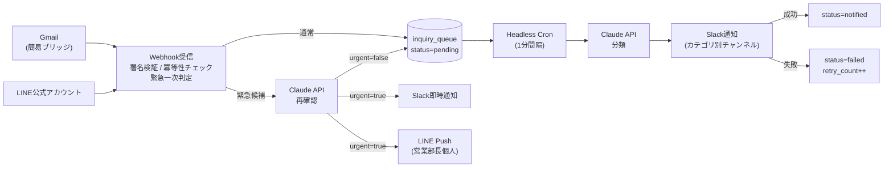
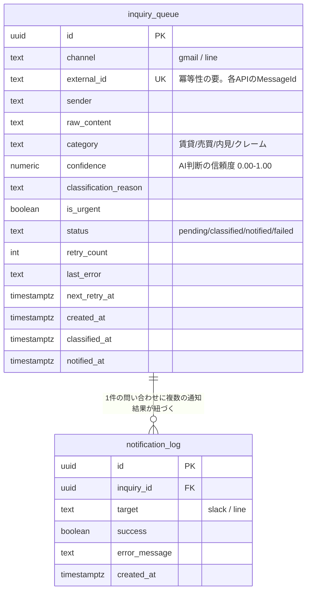

# SwitchBoard — AI Multi-Channel Notification Hub


不動産管理会社向けに、メール・LINEに分散する問い合わせを自動で仕分け、
Slackへ集約しつつ、クレームだけは5分以内に営業部長個人のLINEへ即時通知する
業務自動化システムです。

「AIチャットボットを作る」ではなく、**複数の外部APIを安全かつ低コストで
運用できる仕組みを設計・実装すること**をテーマにしています。

---

## スクリーンショット

> 以下はレイアウト検証用のデザインプレビューです(実機のスクリーンショットではありません)。
> 実データでの見た目は、下記セットアップの「デモモード」で今すぐ確認できます。



## 解決する課題

- 問い合わせがメール・LINE・電話に分散し、対応漏れが発生している
- 営業時間外のLINE問い合わせを見落としてしまう
- クレーム対応の遅れが信頼低下につながっている
- 低予算・短納期でも成立するシステムが必要

## 主な機能 (Features)

- Gmail / LINE公式アカウントからの問い合わせをWebhookで受信し、Slackへ自動集約
- Claude APIによる4カテゴリ分類(賃貸・売買・内見・クレーム)。信頼度スコアと判断理由も保存
- クレーム検出時は5分以内に営業部長個人のLINEへ即時Push通知(緊急パスの分離)
- Webhookの署名検証・`external_id`のUNIQUE制約による冪等性(二重通知防止)
- 通知の成功/失敗をログとして記録し、失敗時は再送回数とエラー内容を保持
- リアルタイムの結線図・統計・問い合わせ一覧・通知ログを備えたダッシュボード

## アーキテクチャ



上記が正常に描画されない場合は、以下のASCII版も参照してください。

```
   Gmail(簡易ブリッジ)      LINE公式アカウント
         │                        │
         ▼                        ▼
   ┌─────────────────────────────────┐
   │   Webhook受信 (Vercel Functions)  │
   │   - 署名検証 / 共有シークレット検証 │
   │   - external_id 冪等性チェック     │
   │   - キーワードによる緊急一次判定    │
   └───────────┬─────────────────────┘
               │
     ┌─────────┴─────────┐
     ▼                   ▼
  通常パス            緊急候補パス
     │                   │
     ▼                   ▼
inquiry_queue      Claude API で再確認
(status=pending)         │
     │            ┌──────┴──────┐
     ▼            ▼             ▼
Headless Cron   urgent=true   urgent=false
(1分ごと)          │             │
     │             ▼             ▼
     ▼        Slack即時通知   通常キューへ
Claude分類      LINE Push      (status=pending)
     │
     ▼
Slack通知 → 成功時のみ status=notified
          → 失敗時は status=failed (retry_count / last_error記録)
```

## 主な設計判断

| 課題 | 設計判断 | 理由 |
|---|---|---|
| Webhookの重複送信 | `external_id` にUNIQUE制約 | LINE/Gmailの再送で二重通知が起きるのを防ぐ(冪等性) |
| 偽装Webhookのリスク | HMAC署名検証(LINE) / 共有シークレット(Gmail) | 不正アクセス・誤通知の防止 |
| クレームを5分以内に通知 | 緊急パスをWebhook受信と同一関数内で完結 | Cronの実行間隔・コールドスタートによる遅延を回避 |
| キーワードだけでは誤検知する | キーワード一次判定 → Claudeで再確認の二段階 | 「緊急ではありません」等の文脈を誤検知しないため |
| AI誤分類の改善 | `confidence` / `classification_reason` を保存 | 後から低信頼度の判定を分析し、プロンプト改善に活用 |
| 障害時に原因を追いたい | `retry_count` / `last_error` / 状態管理 | 「送ったつもり」を防ぎ、失敗理由を後から追跡できる |
| 低予算・低運用コスト | Vercel Functions + Supabase + Headless Cron | 常時稼働サーバー不要。月額数千円〜で運用可能 |

状態遷移は必ず「通知が実際に成功した後」に `notified` へ進めています。
分類が終わった時点で状態を進めてしまうと、Slack送信が失敗していても
「届いたはず」に見えてしまう、という運用上最も危険なパターンを避けるためです。

## Design Decisions

- **Webhook署名検証**: LINEはHMAC-SHA256、Gmail(ブリッジ経由)は共有シークレットで、なりすましリクエストを拒否。比較には`crypto.timingSafeEqual`を使い、タイミング攻撃を防止
- **`external_id`による冪等性**: Webhookの再送で同じ問い合わせを二重処理・二重通知しないよう、DB側でUNIQUE制約を強制
- **緊急パスの分離**: キーワード一次判定 → Claudeでの再確認という二段階を経て、Webhook受信と同一関数内で完結させることで5分以内のSLAを達成
- **Headless Cron採用**: 常時稼働のワーカーサーバーを持たず、1分間隔のバッチ処理で通常パスを消化。低予算案件でも月額数千円台の運用コストに抑制
- **confidence / classification_reasonの保存**: AIの分類結果を「ブラックボックス」にせず、後から誤分類の傾向分析やプロンプト改善に使えるログとして残す
- **状態遷移の一貫性**: 通知成功後にのみstatusを進める設計にし、「送ったつもり」という最も危険な事故パターンを構造的に防止

## 技術構成

- Next.js 14 (App Router) / TypeScript
- Supabase (Postgres) — 問い合わせキュー・通知ログ
- Claude API (Anthropic SDK) — カテゴリ分類・信頼度・緊急度判定
- Slack Web API — カテゴリ別チャンネルへの自動振り分け
- LINE Messaging API — クレーム時の個人LINEへの即時Push
- Vercel Cron — Headlessモードでの1分間隔の自動分類バッチ

## 使用API一覧

| API / サービス | 用途 |
|---|---|
| LINE Messaging API | Webhook受信(署名検証) / 個人LINEへのPush通知 |
| Slack Web API | カテゴリ別チャンネルへの通知(`chat.postMessage`) |
| Anthropic API (Claude) | 問い合わせのカテゴリ分類・信頼度算出・緊急度判定 |
| Supabase (Postgres) | 問い合わせキュー・通知ログの永続化 |
| Vercel Cron | Headlessモードによる1分間隔の自動分類バッチ |

## ER図



## フォルダ構成

```
switchboard-ai-notify/
├── app/
│   ├── page.tsx                    # 管制盤(ダッシュボード)
│   ├── inquiries/page.tsx          # 問い合わせ一覧
│   ├── logs/page.tsx               # 通知ログ
│   └── api/
│       ├── webhooks/line/route.ts  # LINE Webhook受信
│       ├── webhooks/gmail/route.ts # Gmail(ブリッジ経由)Webhook受信
│       └── cron/classify/route.ts  # Headless Cronによる通常パス分類
│
├── components/
│   ├── StatCard.tsx                # 統計カード
│   ├── InquiryRow.tsx              # 問い合わせ1件の行(パッチコード表現)
│   ├── LiveFlowDiagram.tsx         # リアルタイム結線図
│   └── NavBar.tsx
│
├── lib/
│   ├── classify.ts                 # Claude分類ロジック・緊急一次判定
│   ├── urgent-handler.ts           # 緊急候補の共通処理
│   ├── notify-and-track.ts         # 通知結果の記録・状態更新
│   ├── slack.ts / line.ts          # 各API送信ヘルパー
│   ├── supabase.ts                 # サーバー用Supabaseクライアント
│   ├── demo-data.ts                # デモモード用フィクスチャ
│   └── types.ts
│
├── supabase/schema.sql              # テーブル定義・ダッシュボード集計ビュー
├── scripts/
│   ├── test-classify.ts            # Webhook接続前の分類精度検証
│   └── seed.ts                     # ダッシュボード確認用データ投入
└── docs/
    ├── dashboard-preview.svg
    └── portfolio-case-study.md
```

## セットアップ

### 0. まず動きだけ見たい場合(デモモード)

`.env.local` を用意しなくても、`npm install && npm run dev` だけで
フィクスチャデータを使ったダッシュボードが起動します
(Supabaseの環境変数が未設定の場合、自動的にデモモードになります)。
画面上部に `DEMO MODE` のバッジが表示されます。

### 1. 依存パッケージのインストール

```bash
npm install
```

### 2. Supabaseプロジェクトを作成

1. [supabase.com](https://supabase.com) で新規プロジェクトを作成
2. SQL Editorで `supabase/schema.sql` の内容を実行
3. Project Settings → API から `URL` / `anon key` / `service_role key` を取得

### 3. 環境変数を設定

`.env.example` を `.env.local` にコピーし、値を埋める。

```bash
cp .env.example .env.local
```

| 変数名 | 取得元 |
|---|---|
| `NEXT_PUBLIC_SUPABASE_URL` / `SUPABASE_SERVICE_ROLE_KEY` | Supabaseダッシュボード |
| `ANTHROPIC_API_KEY` | console.anthropic.com |
| `LINE_CHANNEL_SECRET` / `LINE_CHANNEL_ACCESS_TOKEN` | LINE Developers Console |
| `SLACK_BOT_TOKEN` | Slack App設定(chat:write スコープが必要) |
| `SLACK_CHANNEL_*` | 各Slackチャンネルの右クリック→チャンネル詳細で確認できるID |
| `CRON_SECRET` | 任意のランダム文字列(Vercelが自動でAuthorizationヘッダーに付与) |
| `GMAIL_BRIDGE_SECRET` | 任意のランダム文字列(下記Gmail連携の補足を参照) |

### 4. ローカルで分類ロジックを検証

Webhook経由で繋ぐ前に、まず分類そのものが正しく動くか確認します。

```bash
npx tsx scripts/test-classify.ts
```

### 5. ダッシュボード用のテストデータを投入

```bash
npm run seed
```

### 6. 開発サーバーを起動

```bash
npm run dev
```

`http://localhost:3000` で管制盤(ダッシュボード)を確認できます。

### 7. Vercelへデプロイ

GitHubリポジトリにpushし、Vercelで連携するだけです。
`vercel.json` の設定により、デプロイ後は自動でCronジョブが有効になります。
環境変数はVercelのプロジェクト設定にも同じ値を登録してください。

> **重要 — Vercel Hobbyプランのcron制限について**
> Hobby(無料)プランでは、cronジョブは**1日1回まで**しか許可されません。
> 本来の設計(Headlessモードによる1分間隔の巡回)を体現するには、Vercel Proプラン
> (`schedule: "* * * * *"`)が必要です。
> このリポジトリの `vercel.json` は、Hobbyプランでもデプロイが通るよう
> `schedule: "0 9 * * *"`(毎日1回)に調整しています。1分間隔で動かす場合は、
> Proプランへアップグートした上で `vercel.json` の schedule を `* * * * *` に戻してください。

## Gmail連携についての補足

Gmail APIの本格的なpush通知(Cloud Pub/Sub経由)はOAuth・Watch登録・
差分取得(history.list)など、MVPの範囲を超える実装コストがかかります。
そのため本プロジェクトでは、Google Apps Scriptなどの軽量なブリッジから
`/api/webhooks/gmail` へメール内容をPOSTしてもらう構成を前提にしています。
認証はGmail側の署名ではなく、共有シークレット(`GMAIL_BRIDGE_SECRET`)で行います。

## 今後の拡張(Phase 2として切り分けた機能)

MVPの範囲を守るため、以下は意図的に対象外としています。

- 電話問い合わせの音声テキスト化(Twilio等との連携)
- 対応者アサイン・対応ステータス管理(誰が対応するか、対応済みにする方法)
- SLAレポート・問い合わせ分析ダッシュボード
- 未対応リマインド・自動再通知

`inquiry_queue` のカラム構成は、これらのPhase 2機能を後から追加しやすいよう
最小限のログ管理(`status` / `confidence` / `retry_count` など)にとどめています。

## Roadmap

- [ ] 電話問い合わせの音声テキスト化(Twilio連携)
- [ ] 対応者アサイン・対応ステータス管理(Slackリアクション連携)
- [ ] 未対応リマインド・自動再通知
- [ ] SLAレポート・カテゴリ別分析ダッシュボード
- [ ] 3段階優先度キュー(pending / priority / urgent)による処理の細分化

## 既知の注意事項

- 依存パッケージ`next`が内部で使用する`postcss`にモデレート severityのアドバイザリが
  残っています(Next.js側の対応待ち)。本番運用前に `npm audit` で最新状況を確認してください。
- Vercel HobbyプランではCronの実行頻度に制限がある場合があります。本番運用時はProプラン以上を推奨します。
